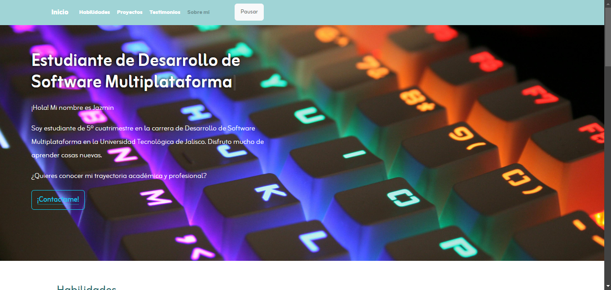
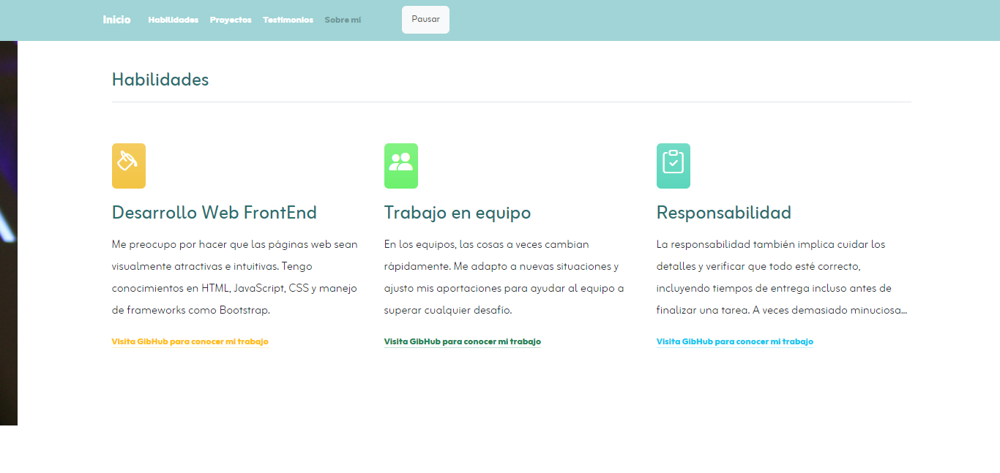
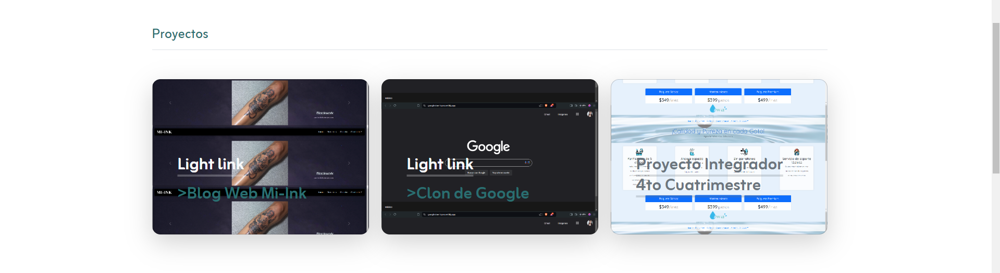
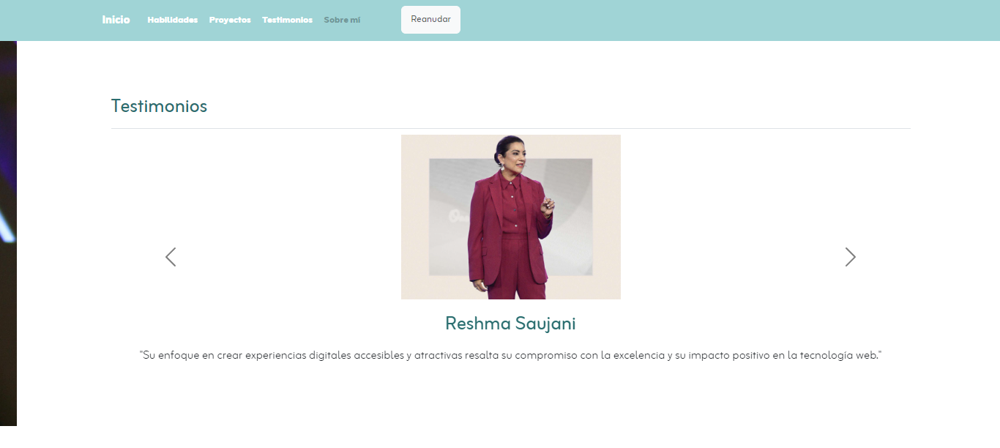
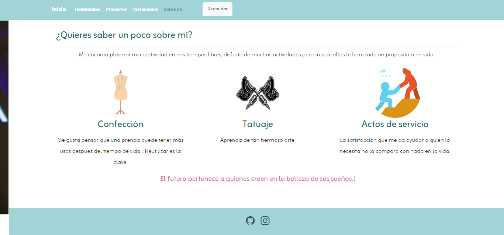

# Mi portafolio de habilidades TECNOLOCHICAS PRO

Este proyecto es un portafolio desarrollado para poner en práctica las habilidades obtenidas dentro del BootCamp de Desarrollo FrontEnd de Tecnolochicas PRO.

Fue desarrollado con HTML, CSS y JS con el uso del framework de UI, BootStrap utilizando además bibliotecas externas.

Este proyecto es responsivo (pues se adapta a distintos tamaños de pantalla) y tambien incluye la presentación de la autora del proyecto.

Proyecto desplegado: [jazminmerva.netlify.app](https://jazminmerva.netlify.app/ "https://jazminmerva.netlify.app")

---

## Secciones de mi sitio

---

## Tecnologías

*HTML
*CSS
*BootStrap
*JavaScript

---

## Desarollado por Jazmin Mercado en [TECHNOLOCHICAS PRO](https://tecnolochicas.mx/)
